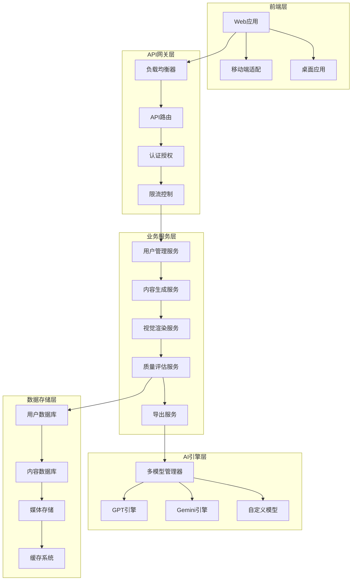

# BINGO知识之象商业化升级设计文档

## 概述

本设计文档基于商业化需求，为BINGO知识之象平台提供全面的技术架构和实现方案。重点关注**视觉美学、内容准确性、商业化功能**三大核心目标。

## 整体架构设计

### 系统架构图



### 核心组件设计

#### 1. 智能内容生成引擎

**设计目标**：实现高质量、准确的概念动画生成

**核心组件**：
- **概念解析器**：分析用户输入，提取关键概念
- **知识图谱**：建立概念间的关系网络
- **脚本生成器**：基于模板和AI生成动画脚本
- **质量评估器**：多维度评估生成内容质量

```python
class ContentGenerationEngine:
    def __init__(self):
        self.concept_parser = ConceptParser()
        self.knowledge_graph = KnowledgeGraph()
        self.script_generator = ScriptGenerator()
        self.quality_assessor = QualityAssessor()
    
    async def generate_animation(self, concept: str, style: str, scene: str):
        # 1. 概念解析和扩展
        parsed_concept = await self.concept_parser.parse(concept)
        
        # 2. 知识图谱查询
        related_concepts = self.knowledge_graph.get_related(parsed_concept)
        
        # 3. 脚本生成
        script = await self.script_generator.generate(
            concept=parsed_concept,
            style=style,
            scene=scene,
            related=related_concepts
        )
        
        # 4. 质量评估
        quality_score = await self.quality_assessor.assess(script)
        
        return AnimationScript(script, quality_score)
```

#### 2. 多风格视觉系统

**设计目标**：提供专业级的视觉效果和多样化风格选择

**风格架构**：
```typescript
interface VisualStyle {
    name: string;
    theme: ThemeConfig;
    animations: AnimationConfig;
    typography: TypographyConfig;
    colors: ColorPalette;
    effects: EffectConfig;
}

// 奢华暗黑风格
const LuxuryDarkStyle: VisualStyle = {
    name: "luxury-dark",
    theme: {
        background: "radial-gradient(circle, #0a0a0f 0%, #1a1a2e 50%, #16213e 100%)",
        accent: ["#00D4FF", "#FFD700", "#9D4EDD"],
        glass: { blur: 20, opacity: 0.1 }
    },
    animations: {
        particles: { count: 100, speed: 0.5, glow: true },
        transitions: { duration: 800, easing: "cubic-bezier(0.25, 0.46, 0.45, 0.94)" },
        parallax: { layers: 3, depth: 0.8 }
    },
    typography: {
        primary: { family: "SF Pro Display", weight: 700, glow: true },
        secondary: { family: "SF Mono", weight: 400, opacity: 0.8 }
    },
    effects: {
        neon: { intensity: 0.8, blur: 4 },
        hologram: { enabled: true, flicker: 0.1 }
    }
};

// Aurora红黑风格
const AuroraRedStyle: VisualStyle = {
    name: "aurora-red",
    theme: {
        background: "#000000",
        accent: ["#E31937"],
        contrast: "ultra-high"
    },
    animations: {
        pageTransition: { type: "slide-vertical", duration: 1200 },
        textReveal: { type: "typewriter", speed: 50 },
        parallax: { intensity: 1.2 }
    },
    typography: {
        primary: { family: "SF Pro Display", weight: 900, size: "clamp(2rem, 8vw, 6rem)" },
        accent: { color: "#E31937", glow: true }
    },
    effects: {
        minimalism: true,
        contrast: "maximum",
        spacing: "generous"
    }
};
```

#### 3. 商业化用户系统

**设计目标**：支持多层级用户管理和付费功能

**用户分级设计**：
```python
from enum import Enum
from dataclasses import dataclass
from typing import List, Optional

class UserTier(Enum):
    FREE = "free"
    PRO = "pro"
    ENTERPRISE = "enterprise"

@dataclass
class UserLimits:
    daily_generations: int
    max_duration: int  # seconds
    export_formats: List[str]
    watermark_free: bool
    priority_queue: bool
    batch_processing: bool
    custom_branding: bool

class UserTierConfig:
    LIMITS = {
        UserTier.FREE: UserLimits(
            daily_generations=5,
            max_duration=30,
            export_formats=["mp4_720p", "gif"],
            watermark_free=False,
            priority_queue=False,
            batch_processing=False,
            custom_branding=False
        ),
        UserTier.PRO: UserLimits(
            daily_generations=50,
            max_duration=300,
            export_formats=["mp4_1080p", "mp4_4k", "mov", "gif", "webm"],
            watermark_free=True,
            priority_queue=True,
            batch_processing=True,
            custom_branding=False
        ),
        UserTier.ENTERPRISE: UserLimits(
            daily_generations=-1,  # unlimited
            max_duration=600,
            export_formats=["all"],
            watermark_free=True,
            priority_queue=True,
            batch_processing=True,
            custom_branding=True
        )
    }
```

#### 4. 智能质量评估系统

**设计目标**：确保生成内容的准确性和质量

**评估维度**：
```python
class QualityMetrics:
    def __init__(self):
        self.accuracy_checker = AccuracyChecker()
        self.visual_analyzer = VisualAnalyzer()
        self.engagement_predictor = EngagementPredictor()
    
    async def evaluate_content(self, content: AnimationContent) -> QualityReport:
        # 1. 准确性检查
        accuracy_score = await self.accuracy_checker.check(
            content.script,
            content.concepts
        )
        
        # 2. 视觉质量分析
        visual_score = await self.visual_analyzer.analyze(
            content.visuals,
            content.style
        )
        
        # 3. 用户参与度预测
        engagement_score = await self.engagement_predictor.predict(
            content.script,
            content.visuals,
            content.target_audience
        )
        
        return QualityReport(
            accuracy=accuracy_score,
            visual_quality=visual_score,
            engagement_potential=engagement_score,
            overall_score=self._calculate_overall(
                accuracy_score, visual_score, engagement_score
            ),
            recommendations=self._generate_recommendations(content)
        )
```

## 数据库设计

### 核心数据模型

```sql
-- 用户表
CREATE TABLE users (
    id UUID PRIMARY KEY DEFAULT gen_random_uuid(),
    email VARCHAR(255) UNIQUE NOT NULL,
    username VARCHAR(100) UNIQUE NOT NULL,
    tier VARCHAR(20) DEFAULT 'free',
    created_at TIMESTAMP DEFAULT NOW(),
    updated_at TIMESTAMP DEFAULT NOW(),
    subscription_expires_at TIMESTAMP,
    usage_stats JSONB DEFAULT '{}'
);

-- 项目表
CREATE TABLE projects (
    id UUID PRIMARY KEY DEFAULT gen_random_uuid(),
    user_id UUID REFERENCES users(id),
    title VARCHAR(255) NOT NULL,
    concept TEXT NOT NULL,
    style VARCHAR(50) NOT NULL,
    scene_type VARCHAR(50) NOT NULL,
    status VARCHAR(20) DEFAULT 'draft',
    created_at TIMESTAMP DEFAULT NOW(),
    updated_at TIMESTAMP DEFAULT NOW()
);

-- 生成内容表
CREATE TABLE generated_content (
    id UUID PRIMARY KEY DEFAULT gen_random_uuid(),
    project_id UUID REFERENCES projects(id),
    content_type VARCHAR(50) NOT NULL,
    content_data JSONB NOT NULL,
    quality_score DECIMAL(3,2),
    generation_time INTEGER, -- milliseconds
    ai_model VARCHAR(100),
    created_at TIMESTAMP DEFAULT NOW()
);

-- 导出记录表
CREATE TABLE exports (
    id UUID PRIMARY KEY DEFAULT gen_random_uuid(),
    project_id UUID REFERENCES projects(id),
    format VARCHAR(20) NOT NULL,
    resolution VARCHAR(20),
    file_size BIGINT,
    file_path TEXT,
    status VARCHAR(20) DEFAULT 'processing',
    created_at TIMESTAMP DEFAULT NOW()
);

-- 使用统计表
CREATE TABLE usage_analytics (
    id UUID PRIMARY KEY DEFAULT gen_random_uuid(),
    user_id UUID REFERENCES users(id),
    action VARCHAR(100) NOT NULL,
    metadata JSONB,
    timestamp TIMESTAMP DEFAULT NOW()
);
```

## API设计

### RESTful API 规范

```python
from fastapi import APIRouter, Depends, HTTPException
from typing import List, Optional

router = APIRouter(prefix="/api/v1")

# 项目管理
@router.post("/projects", response_model=ProjectResponse)
async def create_project(
    project: ProjectCreate,
    user: User = Depends(get_current_user)
):
    """创建新项目"""
    pass

@router.get("/projects", response_model=List[ProjectResponse])
async def list_projects(
    user: User = Depends(get_current_user),
    limit: int = 20,
    offset: int = 0
):
    """获取用户项目列表"""
    pass

# 内容生成
@router.post("/projects/{project_id}/generate")
async def generate_content(
    project_id: str,
    generation_request: GenerationRequest,
    user: User = Depends(get_current_user)
):
    """生成动画内容（流式响应）"""
    pass

@router.get("/projects/{project_id}/preview")
async def preview_content(
    project_id: str,
    user: User = Depends(get_current_user)
):
    """预览生成内容"""
    pass

# 导出功能
@router.post("/projects/{project_id}/export")
async def export_content(
    project_id: str,
    export_config: ExportConfig,
    user: User = Depends(get_current_user)
):
    """导出动画内容"""
    pass

# 用户管理
@router.get("/user/profile")
async def get_user_profile(user: User = Depends(get_current_user)):
    """获取用户资料"""
    pass

@router.get("/user/usage")
async def get_usage_stats(user: User = Depends(get_current_user)):
    """获取使用统计"""
    pass
```

## 前端架构设计

### 组件化架构

```typescript
// 核心应用架构
interface AppState {
    user: UserState;
    projects: ProjectState;
    generation: GenerationState;
    ui: UIState;
}

// 主要组件结构
const ComponentHierarchy = {
    App: {
        Header: {
            Navigation: {},
            UserMenu: {},
            NotificationCenter: {}
        },
        Main: {
            ProjectDashboard: {
                ProjectList: {},
                ProjectCard: {},
                CreateProjectModal: {}
            },
            GenerationWorkspace: {
                ConceptInput: {},
                StyleSelector: {},
                PreviewPanel: {},
                GenerationControls: {}
            },
            ExportCenter: {
                FormatSelector: {},
                QualitySettings: {},
                ProgressTracker: {}
            }
        },
        Footer: {
            StatusBar: {},
            HelpCenter: {}
        }
    }
};

// 状态管理
class StateManager {
    private state: AppState;
    private subscribers: Set<Function> = new Set();
    
    subscribe(callback: Function) {
        this.subscribers.add(callback);
        return () => this.subscribers.delete(callback);
    }
    
    setState(updates: Partial<AppState>) {
        this.state = { ...this.state, ...updates };
        this.subscribers.forEach(callback => callback(this.state));
    }
    
    getState(): AppState {
        return this.state;
    }
}
```

### 响应式设计系统

```css
/* 设计令牌系统 */
:root {
    /* 商业级配色方案 */
    --primary-gradient: linear-gradient(135deg, #002FA7 0%, #0051D5 100%);
    --luxury-gradient: linear-gradient(135deg, #0a0a0f 0%, #1a1a2e 50%, #16213e 100%);
    --aurora-accent: #E31937;
    
    /* 专业级阴影系统 */
    --shadow-premium: 0 20px 40px rgba(0, 47, 167, 0.15);
    --shadow-luxury: 0 25px 50px rgba(0, 0, 0, 0.3);
    --shadow-aurora: 0 10px 30px rgba(227, 25, 55, 0.2);
    
    /* 动画缓动函数 */
    --ease-premium: cubic-bezier(0.25, 0.46, 0.45, 0.94);
    --ease-luxury: cubic-bezier(0.19, 1, 0.22, 1);
    --ease-aurora: cubic-bezier(0.77, 0, 0.175, 1);
}

/* 响应式断点系统 */
@media (max-width: 768px) {
    .generation-workspace {
        grid-template-columns: 1fr;
        gap: 1rem;
    }
    
    .preview-panel {
        height: 40vh;
    }
}

@media (min-width: 1200px) {
    .generation-workspace {
        grid-template-columns: 1fr 2fr 1fr;
        gap: 2rem;
    }
    
    .preview-panel {
        height: 60vh;
    }
}
```

## 性能优化设计

### 1. 前端性能优化

```typescript
// 懒加载和代码分割
const LazyGenerationWorkspace = lazy(() => import('./GenerationWorkspace'));
const LazyExportCenter = lazy(() => import('./ExportCenter'));

// 虚拟滚动优化
class VirtualizedProjectList {
    private itemHeight = 120;
    private containerHeight = 600;
    private visibleCount = Math.ceil(this.containerHeight / this.itemHeight);
    
    getVisibleItems(scrollTop: number, totalItems: number) {
        const startIndex = Math.floor(scrollTop / this.itemHeight);
        const endIndex = Math.min(startIndex + this.visibleCount, totalItems);
        return { startIndex, endIndex };
    }
}

// 缓存策略
class CacheManager {
    private cache = new Map();
    private maxSize = 100;
    
    set(key: string, value: any, ttl: number = 300000) { // 5分钟TTL
        if (this.cache.size >= this.maxSize) {
            const firstKey = this.cache.keys().next().value;
            this.cache.delete(firstKey);
        }
        
        this.cache.set(key, {
            value,
            expires: Date.now() + ttl
        });
    }
    
    get(key: string) {
        const item = this.cache.get(key);
        if (!item || Date.now() > item.expires) {
            this.cache.delete(key);
            return null;
        }
        return item.value;
    }
}
```

### 2. 后端性能优化

```python
# 异步处理和队列系统
import asyncio
from celery import Celery
from redis import Redis

class GenerationQueue:
    def __init__(self):
        self.celery = Celery('bingo', broker='redis://localhost:6379')
        self.redis = Redis(host='localhost', port=6379, db=0)
    
    @self.celery.task
    def generate_animation_task(self, project_id: str, config: dict):
        """异步动画生成任务"""
        try:
            # 更新任务状态
            self.update_task_status(project_id, "processing")
            
            # 执行生成逻辑
            result = self.content_engine.generate(config)
            
            # 保存结果
            self.save_generation_result(project_id, result)
            
            # 更新完成状态
            self.update_task_status(project_id, "completed")
            
        except Exception as e:
            self.update_task_status(project_id, "failed", str(e))
    
    def update_task_status(self, project_id: str, status: str, error: str = None):
        """更新任务状态"""
        status_data = {
            "status": status,
            "timestamp": datetime.now().isoformat(),
            "error": error
        }
        self.redis.setex(f"task:{project_id}", 3600, json.dumps(status_data))

# 数据库连接池优化
from sqlalchemy.pool import QueuePool

engine = create_async_engine(
    DATABASE_URL,
    poolclass=QueuePool,
    pool_size=20,
    max_overflow=30,
    pool_pre_ping=True,
    pool_recycle=3600
)
```

## 安全设计

### 1. 认证授权系统

```python
from jose import JWTError, jwt
from passlib.context import CryptContext
from datetime import datetime, timedelta

class SecurityManager:
    def __init__(self):
        self.pwd_context = CryptContext(schemes=["bcrypt"], deprecated="auto")
        self.secret_key = os.getenv("SECRET_KEY")
        self.algorithm = "HS256"
        self.access_token_expire_minutes = 30
    
    def create_access_token(self, data: dict):
        to_encode = data.copy()
        expire = datetime.utcnow() + timedelta(minutes=self.access_token_expire_minutes)
        to_encode.update({"exp": expire})
        encoded_jwt = jwt.encode(to_encode, self.secret_key, algorithm=self.algorithm)
        return encoded_jwt
    
    def verify_token(self, token: str):
        try:
            payload = jwt.decode(token, self.secret_key, algorithms=[self.algorithm])
            username: str = payload.get("sub")
            if username is None:
                raise HTTPException(status_code=401, detail="Invalid token")
            return username
        except JWTError:
            raise HTTPException(status_code=401, detail="Invalid token")
    
    def hash_password(self, password: str):
        return self.pwd_context.hash(password)
    
    def verify_password(self, plain_password: str, hashed_password: str):
        return self.pwd_context.verify(plain_password, hashed_password)
```

### 2. 数据保护和隐私

```python
# 数据加密
from cryptography.fernet import Fernet

class DataProtection:
    def __init__(self):
        self.key = Fernet.generate_key()
        self.cipher_suite = Fernet(self.key)
    
    def encrypt_sensitive_data(self, data: str) -> str:
        """加密敏感数据"""
        return self.cipher_suite.encrypt(data.encode()).decode()
    
    def decrypt_sensitive_data(self, encrypted_data: str) -> str:
        """解密敏感数据"""
        return self.cipher_suite.decrypt(encrypted_data.encode()).decode()
    
    def anonymize_user_data(self, user_data: dict) -> dict:
        """用户数据匿名化"""
        anonymized = user_data.copy()
        anonymized['email'] = self.hash_email(user_data['email'])
        anonymized['ip_address'] = self.mask_ip(user_data.get('ip_address', ''))
        return anonymized
```

## 监控和分析设计

### 1. 性能监控

```python
import time
from functools import wraps
from prometheus_client import Counter, Histogram, Gauge

# 性能指标收集
REQUEST_COUNT = Counter('http_requests_total', 'Total HTTP requests', ['method', 'endpoint'])
REQUEST_DURATION = Histogram('http_request_duration_seconds', 'HTTP request duration')
ACTIVE_USERS = Gauge('active_users_total', 'Number of active users')
GENERATION_SUCCESS_RATE = Counter('generation_success_total', 'Successful generations')

def monitor_performance(func):
    @wraps(func)
    async def wrapper(*args, **kwargs):
        start_time = time.time()
        try:
            result = await func(*args, **kwargs)
            GENERATION_SUCCESS_RATE.inc()
            return result
        except Exception as e:
            # 记录错误
            logger.error(f"Function {func.__name__} failed: {str(e)}")
            raise
        finally:
            duration = time.time() - start_time
            REQUEST_DURATION.observe(duration)
    
    return wrapper
```

### 2. 用户行为分析

```python
class AnalyticsCollector:
    def __init__(self):
        self.events_queue = asyncio.Queue()
        self.batch_size = 100
        self.flush_interval = 60  # seconds
    
    async def track_event(self, user_id: str, event: str, properties: dict):
        """追踪用户事件"""
        event_data = {
            "user_id": user_id,
            "event": event,
            "properties": properties,
            "timestamp": datetime.utcnow().isoformat()
        }
        await self.events_queue.put(event_data)
    
    async def flush_events(self):
        """批量处理事件数据"""
        events = []
        while len(events) < self.batch_size and not self.events_queue.empty():
            try:
                event = await asyncio.wait_for(self.events_queue.get(), timeout=1.0)
                events.append(event)
            except asyncio.TimeoutError:
                break
        
        if events:
            await self.save_events_to_database(events)
    
    async def generate_insights(self, user_id: str) -> dict:
        """生成用户洞察报告"""
        # 分析用户行为模式
        # 生成个性化建议
        # 预测用户需求
        pass
```

## 部署架构设计

### 1. 容器化部署

```dockerfile
# Dockerfile
FROM python:3.11-slim

WORKDIR /app

# 安装系统依赖
RUN apt-get update && apt-get install -y \
    build-essential \
    curl \
    && rm -rf /var/lib/apt/lists/*

# 安装Python依赖
COPY requirements.txt .
RUN pip install --no-cache-dir -r requirements.txt

# 复制应用代码
COPY . .

# 设置环境变量
ENV PYTHONPATH=/app
ENV PYTHONUNBUFFERED=1

# 暴露端口
EXPOSE 8000

# 启动命令
CMD ["uvicorn", "app:app", "--host", "0.0.0.0", "--port", "8000"]
```

```yaml
# docker-compose.yml
version: '3.8'

services:
  web:
    build: .
    ports:
      - "8000:8000"
    environment:
      - DATABASE_URL=postgresql://user:pass@db:5432/bingo
      - REDIS_URL=redis://redis:6379
    depends_on:
      - db
      - redis
    volumes:
      - ./uploads:/app/uploads

  db:
    image: postgres:15
    environment:
      - POSTGRES_DB=bingo
      - POSTGRES_USER=user
      - POSTGRES_PASSWORD=pass
    volumes:
      - postgres_data:/var/lib/postgresql/data

  redis:
    image: redis:7-alpine
    volumes:
      - redis_data:/data

  nginx:
    image: nginx:alpine
    ports:
      - "80:80"
      - "443:443"
    volumes:
      - ./nginx.conf:/etc/nginx/nginx.conf
      - ./ssl:/etc/nginx/ssl
    depends_on:
      - web

volumes:
  postgres_data:
  redis_data:
```

### 2. 云原生部署

```yaml
# kubernetes/deployment.yaml
apiVersion: apps/v1
kind: Deployment
metadata:
  name: bingo-web
spec:
  replicas: 3
  selector:
    matchLabels:
      app: bingo-web
  template:
    metadata:
      labels:
        app: bingo-web
    spec:
      containers:
      - name: web
        image: bingo/web:latest
        ports:
        - containerPort: 8000
        env:
        - name: DATABASE_URL
          valueFrom:
            secretKeyRef:
              name: bingo-secrets
              key: database-url
        resources:
          requests:
            memory: "512Mi"
            cpu: "250m"
          limits:
            memory: "1Gi"
            cpu: "500m"
---
apiVersion: v1
kind: Service
metadata:
  name: bingo-web-service
spec:
  selector:
    app: bingo-web
  ports:
  - port: 80
    targetPort: 8000
  type: LoadBalancer
```

## 测试策略

### 1. 自动化测试

```python
# 单元测试
import pytest
from unittest.mock import Mock, patch

class TestContentGeneration:
    @pytest.fixture
    def content_engine(self):
        return ContentGenerationEngine()
    
    @pytest.mark.asyncio
    async def test_generate_animation_success(self, content_engine):
        # 测试成功生成动画
        concept = "机器学习基础概念"
        style = "luxury"
        scene = "education"
        
        result = await content_engine.generate_animation(concept, style, scene)
        
        assert result is not None
        assert result.quality_score > 0.8
        assert len(result.script) > 0
    
    @pytest.mark.asyncio
    async def test_generate_animation_invalid_input(self, content_engine):
        # 测试无效输入处理
        with pytest.raises(ValueError):
            await content_engine.generate_animation("", "invalid_style", "education")

# 集成测试
class TestAPIIntegration:
    @pytest.mark.asyncio
    async def test_full_generation_workflow(self, client):
        # 1. 创建项目
        project_data = {
            "title": "测试项目",
            "concept": "深度学习",
            "style": "default",
            "scene_type": "education"
        }
        response = await client.post("/api/v1/projects", json=project_data)
        assert response.status_code == 201
        project_id = response.json()["id"]
        
        # 2. 生成内容
        generation_request = {
            "style": "luxury",
            "quality": "high"
        }
        response = await client.post(
            f"/api/v1/projects/{project_id}/generate",
            json=generation_request
        )
        assert response.status_code == 200
        
        # 3. 导出内容
        export_config = {
            "format": "mp4",
            "resolution": "1080p"
        }
        response = await client.post(
            f"/api/v1/projects/{project_id}/export",
            json=export_config
        )
        assert response.status_code == 202
```

### 2. 性能测试

```python
# 负载测试
import asyncio
import aiohttp
import time

class LoadTester:
    def __init__(self, base_url: str, concurrent_users: int = 100):
        self.base_url = base_url
        self.concurrent_users = concurrent_users
        self.results = []
    
    async def simulate_user_session(self, session: aiohttp.ClientSession):
        """模拟用户会话"""
        start_time = time.time()
        
        try:
            # 1. 登录
            login_response = await session.post(f"{self.base_url}/api/auth/login", json={
                "username": "test_user",
                "password": "test_password"
            })
            
            # 2. 创建项目
            project_response = await session.post(f"{self.base_url}/api/v1/projects", json={
                "title": "Load Test Project",
                "concept": "Test Concept",
                "style": "default"
            })
            
            # 3. 生成内容
            project_id = project_response.json()["id"]
            generation_response = await session.post(
                f"{self.base_url}/api/v1/projects/{project_id}/generate"
            )
            
            end_time = time.time()
            duration = end_time - start_time
            
            self.results.append({
                "duration": duration,
                "success": generation_response.status == 200
            })
            
        except Exception as e:
            self.results.append({
                "duration": time.time() - start_time,
                "success": False,
                "error": str(e)
            })
    
    async def run_load_test(self):
        """运行负载测试"""
        async with aiohttp.ClientSession() as session:
            tasks = [
                self.simulate_user_session(session)
                for _ in range(self.concurrent_users)
            ]
            await asyncio.gather(*tasks)
        
        # 分析结果
        success_rate = sum(1 for r in self.results if r["success"]) / len(self.results)
        avg_duration = sum(r["duration"] for r in self.results) / len(self.results)
        
        print(f"Success Rate: {success_rate:.2%}")
        print(f"Average Duration: {avg_duration:.2f}s")
```

## 总结

本设计文档为BINGO知识之象的商业化升级提供了全面的技术架构和实现方案。重点关注：

1. **视觉美学系统**：多风格支持，专业级视觉效果
2. **内容准确性**：智能质量评估，知识图谱支持
3. **商业化功能**：用户分级，付费功能，数据分析
4. **技术性能**：高并发支持，缓存优化，异步处理
5. **安全可靠**：数据保护，监控告警，容灾备份

通过这套设计方案，BINGO知识之象将成为一个具有强大商业竞争力的知识可视化平台，为教育工作者和自媒体创作者提供专业级的服务。